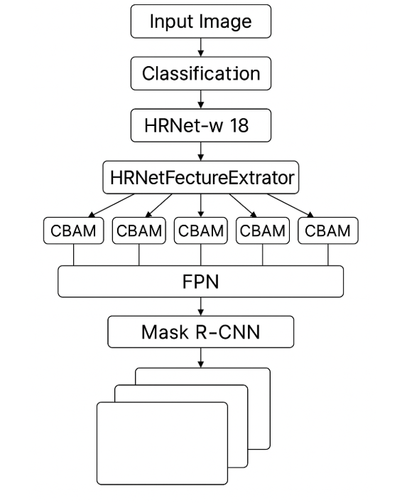

# CBAM_HRNET-As-Backbone-for-Mask-RCNN

## Overview
This repository implements a CBAM-enhanced HRNet backbone for Mask R-CNN, improving attention-based feature extraction and segmentation accuracy.

---

## 1. Introduction
The CBAM-HRNet backbone integrates the Convolutional Block Attention Module (CBAM) with HRNet to enhance feature representation and improve segmentation performance in Mask R-CNN.

---

## 2. Core Modules & Component Details

### 2.1. CBAM (Convolutional Block Attention Module)
CBAM enhances feature representation using **Channel Attention** and **Spatial Attention** mechanisms:

#### Channel Attention:
- Utilizes both average and max pooling.
- Applies 1×1 convolutions with a reduction ratio (default: 16) to compute attention weights.

#### Spatial Attention:
- Aggregates features across channels using mean and max pooling.
- Applies a 7×7 convolution to refine spatial feature maps.

#### Integration:
- Within HRNet, each multi-scale feature map is individually processed by a CBAM module for better attention modeling.

---

### 2.2. HRNet Backbone & Feature Extraction
The HRNet backbone is customized using HRNet-w18, specifically refining stage-4 multi-scale features.

#### Feature Extraction:
- Extracts multi-scale feature maps with channel counts `[18, 36, 72, 144]`.

#### CBAM Integration:
- Each scale’s feature map is processed by its corresponding CBAM module, if enabled.

---

### 2.3. Feature Pyramid Network (FPN)
The FPN fuses multi-scale outputs for refined feature representation.

#### Purpose:
- Unifies multi-scale features extracted by HRNet.

#### Operation:
- Features are structured as an `OrderedDict`, keyed by scales (`'0'`, `'1'`, etc.).
- Processed by FPN, generating refined multi-scale representations for segmentation tasks.

---

### 2.4. Mask R-CNN Integration
The HRNet-FPN backbone is integrated into Mask R-CNN, forming an end-to-end segmentation model.

#### Key Components:
- **Anchor Generator**: Configured with varying sizes and aspect ratios to generate region proposals.
- **RoI Poolers**:
  - **Box RoI Pooler**: Produces 7×7 feature maps.
  - **Mask RoI Pooler**: Generates 14×14 feature maps.
- **Backbone Injection**: The HRNet-FPN backbone, enhanced by CBAM, is embedded into Mask R-CNN for improved segmentation/detection.

---

## 3. Architecture Overview
The overall architecture integrates HRNet-FPN with CBAM for enhanced feature extraction and segmentation accuracy.

